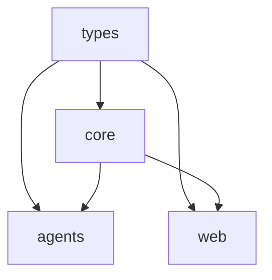

# Runtime Architecture

**Document Version**: 1.0  
**Last Updated**: Sun 29 Jun 18:10:06 UTC 2025  
**Status**: Implemented  

## Overview

Panhandler's runtime architecture is built on **Bun** as the JavaScript runtime, **TypeScript** for type safety, and a **monorepo workspace structure** for efficient development and deployment. This architecture prioritizes performance, developer experience, and maintainability while providing a solid foundation for AI agent orchestration.

## Core Runtime: Bun

### Why Bun Over Node.js/Deno

| Feature | Node.js | Deno | Bun |
|---------|---------|------|-----|
| **Startup Time** | ~50-100ms | ~30-50ms | ~10-20ms |
| **Package Manager** | npm/yarn/pnpm | Built-in | Built-in, faster |
| **TypeScript** | Requires compilation | Native | Native with fast transpilation |
| **Bundler** | Webpack/Vite/etc | Built-in | Built-in, extremely fast |
| **Test Runner** | Jest/Vitest/etc | Built-in | Built-in, compatible |
| **Database Clients** | External packages | External packages | Native PostgreSQL/SQLite |
| **Performance** | V8 engine | V8 engine | JavaScriptCore (faster) |
| **Workspace Support** | Limited | Limited | Excellent monorepo support |

**Key Advantages**:
- **Performance**: 2-3x faster execution for typical workloads
- **Developer Experience**: All-in-one toolchain eliminates configuration complexity
- **Native TypeScript**: No compilation step needed for development
- **Built-in Database**: Native PostgreSQL client reduces dependencies
- **Fast Package Management**: Workspace-aware dependency resolution

### Bun Configuration

```json
// bun.toml (workspace root)
{
  "workspaces": ["packages/*"],
  "install": {
    "frozen": false,
    "cache": "~/.bun/install/cache"
  },
  "run": {
    "shell": "bun"
  }
}
```

**Workspace Benefits**:
- **Shared Dependencies**: Hoisted common packages
- **Cross-Package References**: Type-safe imports between packages
- **Parallel Builds**: Workspace-aware build orchestration
- **Development Scripts**: Unified script execution across packages

## TypeScript Architecture

### Strict Mode Configuration

```json
// tsconfig.json (workspace root)
{
  "compilerOptions": {
    "strict": true,
    "noUncheckedIndexedAccess": true,
    "exactOptionalPropertyTypes": true,
    "noImplicitReturns": true,
    "noFallthroughCasesInSwitch": true,
    "noUncheckedIndexedAccess": true
  }
}
```

**Type Safety Goals**:
- **Zero Runtime Type Errors**: Catch all type issues at compile time
- **Null Safety**: Explicit handling of undefined/null values
- **Exhaustive Checking**: Complete switch statement coverage
- **Strict Function Types**: No implicit any types

### Composite Project Structure

```typescript
// packages/types/tsconfig.json
{
  "extends": "../../tsconfig.json",
  "compilerOptions": {
    "composite": true,
    "declaration": true,
    "outDir": "./dist"
  },
  "references": []
}

// packages/core/tsconfig.json
{
  "extends": "../../tsconfig.json",
  "compilerOptions": {
    "composite": true,
    "declaration": true,
    "outDir": "./dist"
  },
  "references": [
    { "path": "../types" }
  ]
}
```

**Composite Benefits**:
- **Incremental Compilation**: Only rebuild changed packages
- **Type Checking**: Cross-package type validation
- **Build Order**: Automatic dependency-based build sequencing
- **Editor Support**: Fast IntelliSense across workspace

### Type-First Development

**Shared Types Package** (`@panhandler/types`):
```typescript
// Centralized type definitions
export interface AgentConfig {
  id: string;
  type: AgentType;
  parameters: Record<string, unknown>;
}

export interface MigrationContext {
  query: (sql: string, params?: unknown[]) => Promise<unknown[]>;
  execute: (sql: string, params?: unknown[]) => Promise<void>;
  transaction: <T>(fn: (ctx: MigrationContext) => Promise<T>) => Promise<T>;
}
```

**Type-Safe Imports**:
```typescript
// Type-safe cross-package imports
import type { AgentConfig, MigrationContext } from '@panhandler/types';
import { BaseAgent, MigrationManager } from '@panhandler/core';
```

## Monorepo Structure

### Package Organization

```
packages/
├── types/          # Shared TypeScript type definitions
│   ├── src/
│   ├── package.json
│   └── tsconfig.json
├── core/           # Base classes, utilities, database framework
│   ├── src/
│   ├── package.json
│   └── tsconfig.json
├── agents/         # AI agent implementations
│   ├── src/
│   ├── package.json
│   └── tsconfig.json
└── web/            # React frontend interface
    ├── src/
    ├── package.json
    └── tsconfig.json
```

**Design Principles**:
- **Dependency Direction**: Types ← Core ← Agents, Web
- **Single Responsibility**: Each package has clear, focused purpose
- **Minimal Dependencies**: Avoid circular dependencies
- **Reusability**: Core functionality shared across packages

### Build Order and Dependencies



**Build Sequence**:
1. **Types**: Foundation type definitions (no dependencies)
2. **Core**: Base classes and utilities (depends on types)
3. **Agents & Web**: Application packages (depend on types + core)

### Workspace Scripts

```json
// package.json (workspace root)
{
  "scripts": {
    "build:deps": "bun run --filter '@panhandler/types' build && bun run --filter '@panhandler/core' build",
    "build:sequential": "bun run build:deps && bun run --filter '@panhandler/agents' build && bun run --filter '@panhandler/web' build",
    "dev:all": "bun run build:deps && concurrently \"bun run dev:api\" \"bun run dev:web\"",
    "type-check": "bun run --filter '*' type-check"
  }
}
```

**Script Benefits**:
- **Dependency-Aware**: Builds foundation packages first
- **Parallel Execution**: Concurrent builds where possible
- **Workspace Filtering**: Target specific packages or all packages
- **Development Workflow**: Hot reload with proper dependency handling

## Development Workflow Architecture

### Hot Reload Strategy

```typescript
// Development server with TypeScript hot reload
export class DevServer {
  async start() {
    // 1. Build dependencies once
    await this.buildDependencies();
    
    // 2. Start file watchers for source packages
    this.watchTypes();
    this.watchCore();
    
    // 3. Start application servers with hot reload
    await Promise.all([
      this.startAgentServer(),
      this.startWebServer()
    ]);
  }
}
```

**Hot Reload Flow**:
1. **Types Change**: Rebuild types → trigger core rebuild → restart applications
2. **Core Change**: Rebuild core → restart applications
3. **Agent Change**: Hot reload agent code only
4. **Web Change**: Vite hot module replacement

### Build System Architecture

**Incremental Builds**:
```bash
# Only rebuild changed packages
bun run build --incremental

# Force rebuild all packages
bun run build:sequential

# Build specific package and its dependencies
bun run --filter '@panhandler/agents' build
```

**Build Caching**:
- **TypeScript**: `.tsbuildinfo` files for incremental compilation
- **Bun**: Native caching for package resolution and bundling
- **Workspace**: Shared `node_modules` reduces duplicate downloads

### Development Environment

**Local Development Setup**:
```bash
# Complete environment setup
bun run setup:dev

# Start all services
bun run dev:all

# Database operations
bun run db:migrate
bun run db:status
```

**Environment Isolation**:
- **Development**: `.env.development` with local database
- **Testing**: Isolated test database and mock services
- **Production**: Environment-specific configuration validation

## Performance Characteristics

### Bun Performance Metrics

**Startup Performance**:
- **Cold Start**: ~10-20ms (vs Node.js ~50-100ms)
- **Hot Reload**: ~100-200ms for code changes
- **Package Installation**: 2-3x faster than npm
- **Bundle Generation**: 10-20x faster than Webpack

**Runtime Performance**:
- **HTTP Requests**: 30-50% faster response times
- **Database Operations**: Native PostgreSQL client performance
- **File I/O**: JavaScriptCore optimizations
- **Memory Usage**: 20-30% lower than Node.js equivalents

### TypeScript Compilation Performance

**Composite Project Benefits**:
```bash
# Initial build (all packages)
bun run build:sequential  # ~15-20 seconds

# Incremental build (changed packages only)
bun run build           # ~2-5 seconds

# Type checking only
bun run type-check      # ~3-8 seconds
```

**Performance Optimizations**:
- **Project References**: Only rebuild dependent packages
- **Declaration Maps**: Fast cross-package type resolution
- **Incremental Mode**: Cache unchanged compilation results
- **Parallel Processing**: Multiple packages build simultaneously

## Security Architecture

### Runtime Security

**Bun Security Features**:
- **Sandboxed Execution**: Isolated runtime environment
- **Dependency Verification**: Package integrity checking
- **Minimal Attack Surface**: Smaller runtime than Node.js
- **Native Code**: Reduced JavaScript attack vectors

**TypeScript Security Benefits**:
- **Type Safety**: Prevents many runtime vulnerabilities
- **Compile-Time Validation**: Catch security issues early
- **No eval()**: Strict mode prevents dynamic code execution
- **Input Validation**: Type-safe API boundaries

### Package Security

**Dependency Management**:
```json
// bun.lockb provides cryptographic verification
{
  "lockfile_version": 3,
  "packages": {
    "@types/node": {
      "version": "18.0.0",
      "integrity": "sha512-...",
      "dependencies": {}
    }
  }
}
```

**Security Practices**:
- **Lockfile Verification**: Cryptographic package integrity
- **Minimal Dependencies**: Reduce attack surface
- **Regular Updates**: Automated security patch application
- **Audit Scanning**: Built-in vulnerability detection

## Monitoring and Observability

### Performance Monitoring

**Runtime Metrics**:
```typescript
// Built-in performance tracking
export class PerformanceMonitor {
  trackRequest(req: Request): void {
    const startTime = Bun.nanoseconds();
    // ... handle request
    const duration = Bun.nanoseconds() - startTime;
    this.recordMetric('request_duration', duration);
  }
}
```

**Key Metrics**:
- **Response Times**: HTTP request/response latency
- **Memory Usage**: Heap and native memory consumption
- **CPU Utilization**: Runtime performance characteristics
- **Database Performance**: Query execution times

### Development Metrics

**Build Performance Tracking**:
- **Compilation Time**: TypeScript build duration per package
- **Bundle Size**: Generated bundle size and optimization
- **Test Execution**: Test suite performance and coverage
- **Hot Reload Speed**: Development iteration time

## Alternative Technologies Considered

### Runtime Alternatives

| Technology | Pros | Cons | Decision |
|------------|------|------|----------|
| **Node.js** | Mature ecosystem, wide adoption | Slower startup, complex tooling | Not chosen - performance |
| **Deno** | Modern design, TypeScript native | Smaller ecosystem, fewer tools | Not chosen - tooling gaps |
| **Bun** | Fastest performance, all-in-one | Newer ecosystem, some compatibility | Chosen - best fit |

### Monorepo Alternatives

| Technology | Pros | Cons | Decision |
|------------|------|------|----------|
| **Lerna** | Mature, widely used | Complex configuration, slow | Not chosen - complexity |
| **Nx** | Powerful, enterprise-ready | Heavy tooling, learning curve | Not chosen - overkill |
| **Rush** | Microsoft backing, scalable | Complex setup, Windows-focused | Not chosen - complexity |
| **Bun Workspaces** | Simple, fast, native TypeScript | Newer, less ecosystem | Chosen - simplicity + performance |

## Future Considerations

### Planned Enhancements

1. **Performance Optimization**: Further runtime optimization with Bun updates
2. **Hot Reload Improvements**: Faster development iteration cycles
3. **Build Caching**: Distributed build cache for team development
4. **Bundle Optimization**: Advanced tree-shaking and code splitting
5. **Development Tools**: Enhanced debugging and profiling capabilities

### Scalability Considerations

- **Multi-Process**: Bun cluster mode for CPU-intensive workloads
- **Memory Management**: Optimized garbage collection for long-running processes
- **Package Distribution**: CDN-based package delivery for faster installs
- **Build Distribution**: Distributed compilation for large codebases

## Decision Log

| Date | Decision | Rationale | Alternatives Considered |
|------|----------|-----------|------------------------|
| 2025-06-29 | Bun Runtime | Performance, DX, all-in-one tooling | Node.js, Deno |
| 2025-06-29 | TypeScript Strict Mode | Type safety, error prevention | JavaScript, loose TypeScript |
| 2025-06-29 | Bun Workspaces | Simplicity, performance, native support | Lerna, Nx, Rush |
| 2025-06-29 | Composite Projects | Build performance, type safety | Single tsconfig, separate builds |

---

**Related Documents**:
- [Database Architecture](./database.md)
- [Development Workflow](./development-workflow.md)
- [Build System](./build-system.md) 